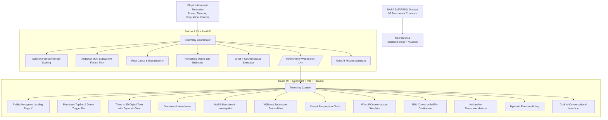

# ORBITAL TWIN 🛰️
### AI-Powered Spacecraft Digital Twin & Mission Intelligence Platform

> **"See the Future of Your Spacecraft Before It Happens."**  
> *Monitor. Detect. Predict. Simulate. Decide.*

---

## 1. System Overview

**ORBITAL TWIN** is a production-quality, fully functional aerospace mission operations platform inspired by NASA/ESA mission control centers. It bridges physical spacecraft dynamics with real-time machine learning intelligence to transition flight operations from reactive threshold alarms to predictive, explainable mission assurance.

### The Core Operational Loop
$$\text{REAL / SIMULATED TELEMETRY} \longrightarrow \text{DIGITAL TWIN} \longrightarrow \text{ANOMALY} \longrightarrow \text{PREDICTION} \longrightarrow \text{ROOT CAUSE} \longrightarrow \text{WHAT-IF SIMULATION} \longrightarrow \text{RECOMMENDATION} \longrightarrow \text{DECISION}$$

---

## 2. Scientific Honesty & Data Principle

> **Scientific Transparency Statement**:  
> *"NASA SMAP/MSL telemetry is used as a real-world anomaly-detection reference dataset. Additional spacecraft parameters (fuel pressure, battery internal impedance, radiator loop efficiency, RF packet loss) and failure scenarios are generated using a physics-informed simulation layer for this prototype."*

- **NASA SMAP/MSL Benchmark**: 82 discrete time-series channels from SMAP and MSL curiosity rover paired with ground-truth labeled anomaly sequences.
- **Physics-Informed Simulation**: Coupled thermodynamic heat balance, electrochemical battery discharge kinetics, monopropellant tank pressure, and RF link budget models.
- **Strict Separation**: NASA-derived telemetry and synthetic physics states are never conflated or misrepresented.

---

## 3. Technology Architecture



---

## 4. Quick Start & Execution

### Prerequisites
- Python 3.10+ (Verified on Python 3.13)
- Node.js 18+ (Verified on Node.js v22)
- npm 9+

### Step 1: Backend Setup
```bash
# In repository root:
# 1. Install backend dependencies (if needed)
python -m pip install fastapi uvicorn websockets pydantic pydantic-settings sqlalchemy scikit-learn xgboost pandas numpy scipy httpx

# 2. Train and serialize ML models on NASA and spacecraft telemetry
python backend/app/ml/train_models.py

# 3. Launch FastAPI backend with live telemetry loop & WebSockets
python -m uvicorn backend.app.main:app --host 0.0.0.0 --port 8000
```
Backend runs at: `http://localhost:8000` (API docs at `http://localhost:8000/docs`).

### Step 2: Frontend Setup
```bash
# In frontend directory:
cd frontend

# 1. Install dependencies
npm install

# 2. Run Vite development server
npm run dev
```
Frontend runs at: `http://localhost:5173`.

---

## 5. Live Demonstration Sequence (23-Step Hackathon Demo Flow)

The platform is engineered to support the complete end-to-end mission demonstration:

1. **Open Landing Page** at `http://localhost:5173/` – observe aerospace theme, orbital lines, and 3D preview.
2. Click **[ ENTER MISSION CONTROL ]** – routes to `/mission-control/overview`.
3. Overview displays nominal spacecraft health (~95%) with all green indicators.
4. Navigate to **Digital Twin** (`/mission-control/digital-twin`) – rotate, zoom, and click components.
5. In the persistent **Top Bar Demo Scenario Panel**, click **[ THERMAL DEGRADATION ]**.
6. Observe bus temperature start gradually climbing from 24°C towards 65°C.
7. Power consumption increases as fluid loop pumps over-exert.
8. Battery temperature climbs to ~38°C due to ambient coupling.
9. In the **3D Digital Twin**, the thermal radiator panel dynamically shifts from cyan to glowing amber and red!
10. Navigate to **Anomalies** (`/mission-control/anomalies`) – Isolation Forest flags anomaly score climbing to 92% (CRITICAL).
11. Click **[ INVESTIGATE ]** – inspect ground-truth NASA SMAP/MSL channel comparison.
12. Navigate to **Predictions** (`/mission-control/predictions`) – XGBoost projects Thermal Failure probability at ~78% within a 2–4 hour window.
13. Navigate to **Root Cause** (`/mission-control/root-cause`) – view the 5-step causal chain and empirical evidence table showing +24% temp and -35% cooling efficiency.
14. Navigate to **Recommendations** (`/mission-control/recommendations`) – system recommends shedding 35% payload power and engaging secondary coolant loop B.
15. Click **[ SIMULATE ACTION ]** – automatically opens the **What-If Scenario Simulator**.
16. Click **[ RUN WHAT-IF SIMULATION ]** – compares **WITHOUT INTERVENTION** (health collapses to 42%) vs **WITH MITIGATION** (health recovers to 88% with bus temp stabilizing at 26°C).
17. Navigate to **Remaining Useful Life** (`/mission-control/rul`) – observe battery and radiator RUL curves with 95% confidence intervals.
18. Navigate to **Mission Timeline** (`/mission-control/timeline`) – view the dynamic chronological audit log of the incident.
19. Navigate to **AI Assistant** (`/mission-control/ai-assistant`) – ask: *"Why did the spacecraft enter a high-risk state?"*
20. Grok AI responds with structured, evidence-based technical analysis citing exact telemetry numbers and model outputs without hallucination.
21. In Demo Panel, click **[ NORMAL ]** – spacecraft telemetry smoothly stabilizes back to nominal green baseline.

---

## 6. Documentation Index

- [DATA_DICTIONARY.md](docs/DATA_DICTIONARY.md): Complete variable specification and NASA SMAP/MSL channel breakdown.
- [MODEL_DOCUMENTATION.md](docs/MODEL_DOCUMENTATION.md): Isolation Forest, XGBoost multi-output models, and time-series leakage prevention.
- [SIMULATION_MODEL.md](docs/SIMULATION_MODEL.md): Coupled physical equations and degradation kinetics.
- [API_DOCUMENTATION.md](docs/API_DOCUMENTATION.md): REST endpoints and WebSocket protocol specification.
