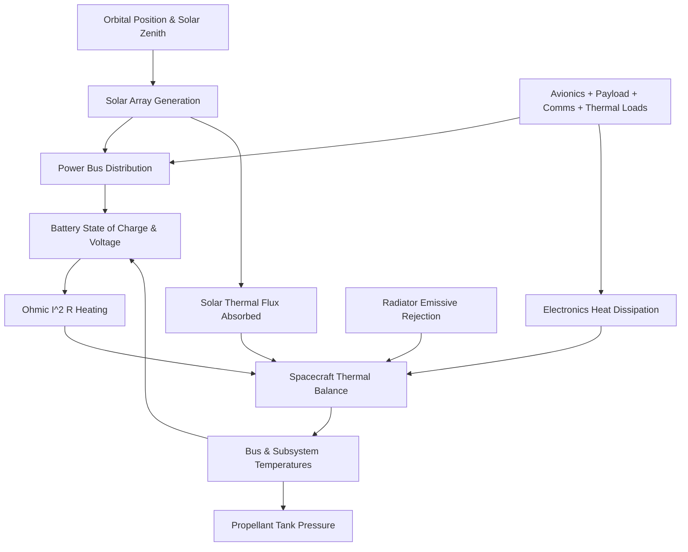

# ORBITAL TWIN - PHYSICS-INFORMED SPACECRAFT SIMULATION MODEL

## 1. Physics Engine Architecture

The physics simulation engine (`backend/app/simulation/physics_engine.py`) models coupled, continuous dynamical subsystems for a 3-axis stabilized Low Earth Orbit (LEO) satellite.

---

## 2. Subsystem Mathematical Models

### 2.1 Orbital Dynamics & Solar Array Generation
- Orbit period $T_{orbit} = 5520 \text{ s}$ (~92 minutes).
- Sunlit fraction: ~65% ($t_{sun} \approx 60 \text{ min}$), eclipse fraction: ~35% ($t_{eclipse} \approx 32 \text{ min}$).
- Solar flux incident on triple-junction GaAs panels ($A_{array} = 6.2 \text{ m}^2$, $\eta_{nom} = 29.5\%$):
  $$P_{solar}(t) = 1361 \cdot A_{array} \cdot \eta \cdot \cos(\theta_{zenith}) \cdot (1 - \text{degradation})$$

### 2.2 Electrical Power & Battery Dynamics
- Bus Net Power: $P_{net} = P_{solar} - P_{consumption}$
- If $P_{net} \ge 0$: Charging current $I_{chg} = \frac{P_{net}}{V_{bus}} \cdot \eta_{chg}$
- If $P_{net} < 0$: Discharge current $I_{dis} = \frac{|P_{net}|}{V_{bus} \cdot \eta_{dis}}$
- Battery State of Charge (SoC):
  $$\frac{dSoC}{dt} = \frac{P_{net}}{C_{capacity} \cdot V_{nom}} \cdot 100$$
- Terminal Voltage with internal resistance $R_{int}$ sag:
  $$V_{bus} = V_{open\_circuit}(SoC) - I_{dis} \cdot R_{int}$$

### 2.3 Thermal Energy Balance
- Spacecraft bulk thermal capacity $C_{th} = 25,000 \text{ J/K}$.
- Total Heat Inflow: $Q_{in} = Q_{dissipated\_electronics} + Q_{solar\_absorbed} + I^2 R_{int}$
- Radiative Rejection to deep space ($T_{space} \approx 3\text{K}$):
  $$Q_{out} = \epsilon \cdot \sigma \cdot A_{radiator} \cdot (T_{craft}^4 - T_{space}^4) \cdot \eta_{cooling}$$
- Dynamic Temperature Rate:
  $$C_{th} \frac{dT_{craft}}{dt} = Q_{in} - Q_{out}$$

### 2.4 Propulsion & Cold Gas / Monopropellant Pressure
- Tank pressure governed by ideal gas law:
  $$P_{tank}(t) = P_{tank,0} \cdot \left(\frac{m_{fuel}(t)}{m_{fuel,0}}\right) \cdot \left(\frac{T_{craft}(t) + 273.15}{T_0 + 273.15}\right)$$
- Chamber pressure: $P_{chamber} = P_{tank} \cdot k_{regulator}$

### 2.5 RF Link Budget & Packet Loss
- Signal-to-Noise Ratio (SNR) calculated with free space path loss and antenna gimbal pointing error $\theta_{err}$:
  $$SNR(t) = SNR_0 - 14.0 \cdot (\theta_{err})^2 - \Delta L_{comm}$$
- Packet Loss percentage modeled via logistic sigmoid:
  $$P_{loss} = \frac{1}{1 + \exp((SNR - 12.0) / 2.0)}$$

---

## 3. Degradation Sequences

The scenario manager (`backend/app/simulation/scenario_manager.py`) transitions degradation smoothly:

$$\text{NORMAL} \xrightarrow{15\%} \text{MINOR DEVIATION} \xrightarrow{35\%} \text{EARLY ANOMALY} \xrightarrow{55\%} \text{WARNING} \xrightarrow{75\%} \text{DEGRADATION} \xrightarrow{90\%} \text{CRITICAL} \xrightarrow{100\%} \text{FAILURE}$$

This realistic multi-stage progression allows ground controllers to observe predictive maintenance flags hours before catastrophic failure occurs.
